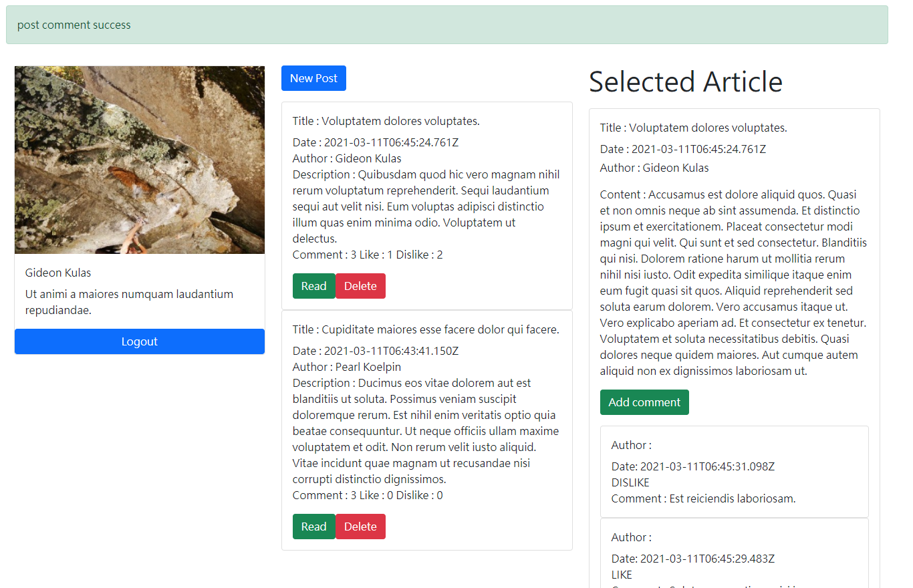

# Build Node.js RESTful API with JSON Web Token

## Demo



## Using

#### Json Web Token :custard:

> Use jwt to verify Post and Delete actions :memo:

#### Separate Front-end & Back-end  :airplane:

> MERN structure : React as frontend & Node.js as backend to achieve front-end & back-end separate structure :zap:

#### RESTful API :speaker:

> Connected Frontend & Backend with RESTful API, and with method-override to achieve :heart:

#### MVC structure :hammer:

> custom controller to check json-web-token and authorize actions  :rocket:
> Mongoose as Modal :wrench:
> React as View :thumbsup:


#### React Component lifecycle

> Using Hooks to achieve lifecycle of React component ( getComments while Mount, deleteComments while Unmount ) :ocean:

#### faker.js

> random generate user and post and comment :rabbit:

## How 2 install

Install modules

```
npm install
```

Add environment variable

```
DATA_BASEURI=YOUR_MONGODB_URI
SECRET_JWT=YOUR_TOKEN_SECRET_KEY
```

You can generate secret key by running "crypto_generator.js" file

```
node crypto_generator
```

## Run Server

Now You can run the server and see it on localhost:3000

```
npm start
```

## Update React

#### You can customize your frontend in client folder !

Customize React ( you should open second terminal to run backend while dev !)

```
// terminal 1 (React)
cd client
npm start

// terminal 2 (Node.js)
npm start
```

After dev, Build frontend before deploy !

```
// at client folder
npm run build
```

Done ! Now You can run the server and see it on localhost:3000

```
npm start
```


